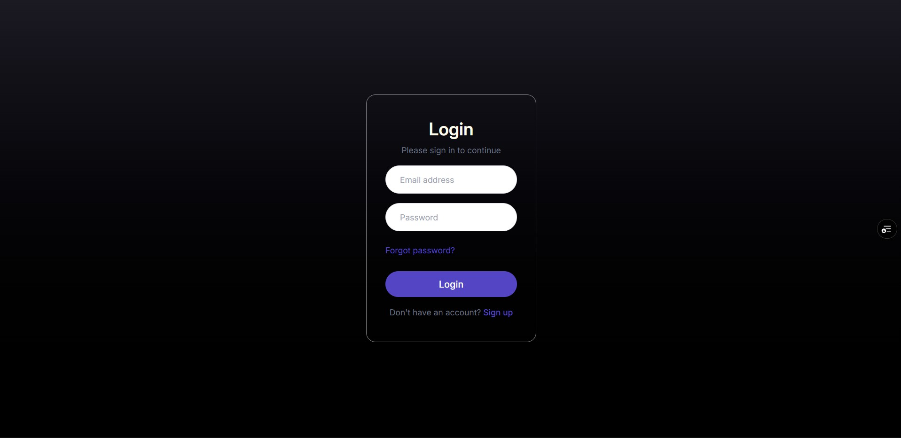
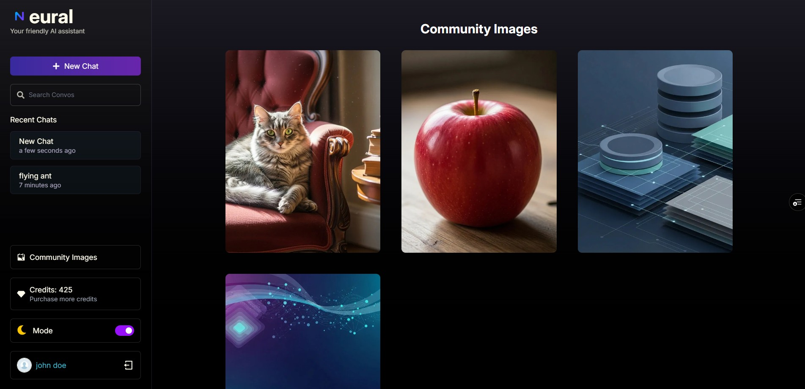

<div align="center">


---

# Neura Client

<p align="center">
  <em>Where intelligence meets conversation - powered by cutting-edge AI</em>
</p>

[](https://opensource.org/licenses/MIT)
[](https://github.com/JOSIAHTHEPROGRAMMER/Neura/stargazers)
[](https://github.com/JOSIAHTHEPROGRAMMER/Neura/network)
[](http://makeapullrequest.com)

</div>

---

## Overview

**Neura** is a modern, responsive React frontend for an AI-powered chatbot and image generation platform. Built with the latest web technologies, it delivers a seamless user experience for interacting with AI models, generating stunning images, and managing AI usage through an intuitive interface.

> **Backend Repository:** [Neura-server](https://github.com/JOSIAHTHEPROGRAMMER/Neura-server)

---

## Visual Preview

<div align="center">

<table>
<tr>
<td width="50%">


<p align="center"><b>Secure Authentication</b></p>

</td>
<td width="50%">


<p align="center"><b>AI-Powered Chat</b></p>

</td>
</tr>
<tr>
<td width="50%">


<p align="center"><b>Community Images</b></p>

</td>
<td width="50%">


<p align="center"><b>Flexible Pricing</b></p>

</td>
</tr>
</table>

</div>

---

## Features

### User Interface

- **Responsive Design** - Mobile-first approach with Tailwind CSS
- **Dark/Light Mode** - Seamless theme switching with persistent preferences
- **Smooth Animations** - Powered by Framer Motion for fluid transitions
- **Modern Layout** - Clean, intuitive navigation and component structure

### Chat Interface

- **Real-time Messaging** - Instant AI responses with streaming support
- **Markdown Rendering** - Rich text formatting with React Markdown
- **Syntax Highlighting** - Code blocks with PrismJS integration
- **Chat History** - Persistent conversation management
- **Context Awareness** - Multi-turn conversations with memory

### Image Generation

- **Text-to-Image** - AI-powered image creation from prompts
- **Image Gallery** - Browse and manage generated images
- **Community Feed** - Share and explore public creations
- **High-Quality Output** - Cloud-based image storage and delivery

### User Management

- **Authentication Flow** - Login, registration, and password recovery
- **Protected Routes** - Secure navigation with JWT validation
- **Profile Management** - User data and preferences
- **Credit System** - Visual credit balance and usage tracking

### Payment Integration

- **Stripe Checkout** - Secure payment processing
- **Multiple Plans** - Flexible pricing tiers
- **Credit Purchase** - Seamless in-app transactions
- **Payment History** - Transaction tracking and receipts

---

## Tech Stack

<div align="center">


</div>

### Core Technologies

- **React 18** - Modern React with hooks and concurrent features
- **Vite** - Lightning-fast build tool and dev server
- **React Router v6** - Client-side routing and navigation
- **Tailwind CSS** - Utility-first CSS framework
- **Framer Motion** - Production-ready animation library

### Additional Libraries

- **React Markdown** - Markdown rendering with plugin support
- **PrismJS** - Syntax highlighting for code blocks
- **React Icons** - Comprehensive icon library
- **Axios** - HTTP client for API requests
- **Stripe.js** - Payment processing integration

---

## Installation

### Prerequisites

```bash
Node.js >= 20.5
npm or yarn
```

### Quick Start

1. **Clone the repository**

```bash
git clone https://github.com/JOSIAHTHEPROGRAMMER/Neura.git
cd Neura
```

2. **Install dependencies**

```bash
npm install
```

3. **Environment Setup**

Create a `.env` file in the root directory:

```ini
VITE_SERVER_URL=http://localhost:5000
# or your deployed backend URL
```

4. **Start development server**

```bash
npm run dev
```

5. **Access the application**

Navigate to `http://localhost:5173` in your browser

### Build for Production

```bash
npm run build
```

The optimized production build will be generated in the `dist/` directory.

### Preview Production Build

```bash
npm run preview
```

---

## Project Structure

```
Neura/
├── public/                 # Static assets
├── src/
│   ├── assets/            # Images, logos, and media files
│   │   ├── logo.webp
│   │   ├── neura-login.jpg
│   │   ├── neura-new-chat.jpg
│   │   ├── neura-community.jpg
│   │   └── neura-payment-plans.jpg
│   ├── components/        # React components
│   │   ├── ui/           # Reusable UI components
│   │   │   ├── Button.jsx
│   │   │   ├── Input.jsx
│   │   │   ├── Modal.jsx
│   │   │   └── ...
│   │   ├── Chat/         # Chat-related components
│   │   ├── Auth/         # Authentication components
│   │   └── Layout/       # Layout components
│   ├── context/          # React Context providers
│   │   ├── AuthContext.jsx
│   │   ├── ThemeContext.jsx
│   │   └── ChatContext.jsx
│   ├── lib/              # Utility functions
│   │   ├── api.js
│   │   ├── constants.js
│   │   └── helpers.js
│   ├── pages/            # Route pages
│   │   ├── Home.jsx
│   │   ├── Login.jsx
│   │   ├── Dashboard.jsx
│   │   ├── Chat.jsx
│   │   ├── Community.jsx
│   │   └── Pricing.jsx
│   ├── App.jsx           # Main App component
│   ├── main.jsx          # Application entry point
│   └── index.css         # Global styles
├── .env                   # Environment variables
├── .gitignore
├── index.html
├── package.json
├── postcss.config.js
├── tailwind.config.js
└── vite.config.js
```

---

## Key Components

### Authentication

- **Login/Register** - User authentication forms with validation
- **Password Recovery** - Email-based password reset flow
- **Protected Routes** - HOC for route protection

### Chat Interface

- **ChatWindow** - Main chat interface with message history
- **MessageInput** - Text input with send functionality
- **MessageBubble** - Individual message component with markdown support
- **ChatSidebar** - Chat history and navigation

### Image Generation

- **ImageGenerator** - Text-to-image prompt interface
- **ImageGallery** - Grid display of generated images
- **ImageModal** - Full-size image viewer with actions

### UI Components

- **Navbar** - Responsive navigation with theme toggle
- **Sidebar** - Collapsible menu with route links
- **Button** - Reusable button with variants
- **Input** - Form input with validation states
- **Modal** - Flexible modal dialog component
- **LoadingSpinner** - Loading state indicator

---

## API Integration

The frontend communicates with the [Neura-server](https://github.com/JOSIAHTHEPROGRAMMER/Neura-server) backend through RESTful API endpoints.

### Base Configuration

```javascript
// lib/api.js
import axios from "axios";

const api = axios.create({
  baseURL: import.meta.env.VITE_SERVER_URL,
  headers: {
    "Content-Type": "application/json",
  },
});
```

### Authenticated Requests

```javascript
// Automatically attach JWT token to requests
api.interceptors.request.use((config) => {
  const token = localStorage.getItem("token");
  if (token) {
    config.headers.Authorization = `Bearer ${token}`;
  }
  return config;
});
```

---

## Environment Variables

| Variable          | Description     | Example                 |
| ----------------- | --------------- | ----------------------- |
| `VITE_SERVER_URL` | Backend API URL | `http://localhost:5000` |

---

## Styling

### Tailwind Configuration

Custom theme extensions in `tailwind.config.js`:

```javascript
export default {
  theme: {
    extend: {
      colors: {
        primary: "#00d4ff",
        secondary: "#ff6b9d",
        dark: "#1a1a1a",
        light: "#f5f5f5",
      },
      fontFamily: {
        sans: ["Inter", "system-ui", "sans-serif"],
      },
    },
  },
};
```

### Dark Mode

Tailwind's dark mode is configured with class strategy for manual toggling:

```javascript
// tailwind.config.js
export default {
  darkMode: "class",
  // ...
};
```

---

## Scripts

| Command           | Description                       |
| ----------------- | --------------------------------- |
| `npm run dev`     | Start development server with HMR |
| `npm run build`   | Build optimized production bundle |
| `npm run preview` | Preview production build locally  |
| `npm run lint`    | Run ESLint for code quality       |

---

## Browser Support

- Chrome (latest)
- Firefox (latest)
- Safari (latest)
- Edge (latest)

---

## Contributing

Contributions are welcome! Here's how you can help:

1. **Fork the repository**
2. **Create a feature branch**
   ```bash
   git checkout -b feature/AmazingFeature
   ```
3. **Commit your changes**
   ```bash
   git commit -m 'Add some AmazingFeature'
   ```
4. **Push to the branch**
   ```bash
   git push origin feature/AmazingFeature
   ```
5. **Open a Pull Request**

Please ensure your code follows the existing style and includes appropriate tests.

---

## License

Distributed under the MIT License. See `LICENSE` for more information.

---

<div align="center">

## Contact & Support

[](https://www.linkedin.com/in/josiah-alexis-a958a0223)
[](mailto:josiahalexis15@gmail.com)
[](https://we-go-pass.vercel.app/)

**If you find this project helpful, please consider giving it a star!**

</div>

---

<div align="center">


**Backend Repository:** [Neura-server](https://github.com/JOSIAHTHEPROGRAMMER/Neura-server)

</div>
