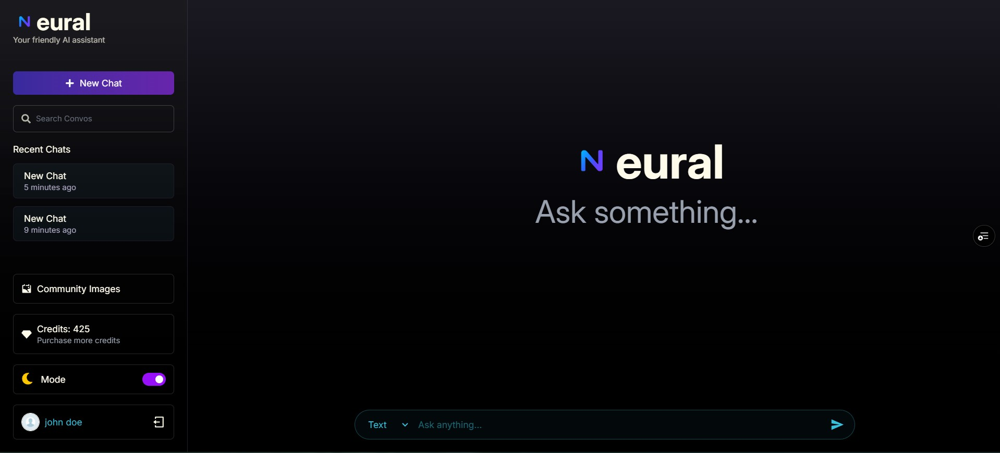
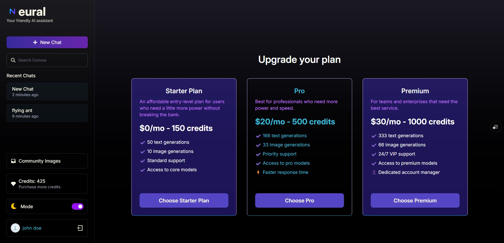
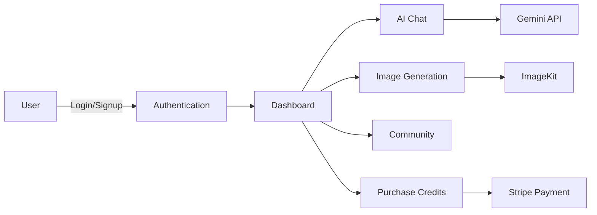

<div align="center">

```
                  ╔═══════════════════════════════════════════════════════════════════╗
                  ║                                                                   ║
                  ║             ███╗   ██╗███████╗██╗   ██╗██████╗  █████╗            ║
                  ║             ████╗  ██║██╔════╝██║   ██║██╔══██╗██╔══██╗           ║
                  ║             ██╔██╗ ██║█████╗  ██║   ██║██████╔╝███████║           ║
                  ║             ██║╚██╗██║██╔══╝  ██║   ██║██╔══██╗██╔══██║           ║
                  ║             ██║ ╚████║███████╗╚██████╔╝██║  ██║██║  ██║           ║
                  ║             ╚═╝  ╚═══╝╚══════╝ ╚═════╝ ╚═╝  ╚═╝╚═╝  ╚═╝           ║
                  ║                                                                   ║
                  ║             ⚡ Neural AI Chatbot & Image Generation ⚡           ║
                  ║                                                                   ║
                  ╚═══════════════════════════════════════════════════════════════════╝
```
</div>

<div align="center">
<p align="center">
  <em>Where intelligence meets conversation — powered by cutting-edge AI</em>
</p>

[](https://opensource.org/licenses/MIT)
[](https://github.com/JOSIAHTHEPROGRAMMER/Neura/stargazers)
[](https://github.com/JOSIAHTHEPROGRAMMER/Neura/network)
[](http://makeapullrequest.com)

</div>

---

<div align="center">

## Visual Preview

</div>

<div align="center">

<table>
<tr>
<td width="50%">


<p align="center"><b>Secure Authentication</b></p>

</td>
<td width="50%">


<p align="center"><b>AI-Powered Chat</b></p>

</td>
</tr>
<tr>
<td width="50%">


<p align="center"><b>Community Images</b></p>

</td>
<td width="50%">


<p align="center"><b>Flexible Pricing</b></p>

</td>
</tr>
</table>

</div>

---

## What is Neura?

**Neura** is a full-stack MERN application that brings together the power of AI conversation and image generation in one elegant platform. Built with modern web technologies, Neura offers users an intuitive interface to interact with cutting-edge AI models, generate stunning images, and manage their AI usage through a flexible credit system.

---

## Core Features

<div align="center">

| Feature | Description |
|---------|-------------|
| **Authentication System** | Secure JWT-based authentication • Bcrypt password hashing • Protected routes and API endpoints |
| **AI-Powered Chat** | Natural language processing via Google Gemini • Context-aware conversations • Chat history persistence • Markdown support with syntax highlighting |
| **Image Generation** | Text-to-image with ImageKit • High-quality AI-generated visuals • Cloud storage integration |
| **Credit System** | Flexible pay-as-you-go model • Secure Stripe payment integration • Webhook-based credit allocation • Multiple pricing tiers |
| **Modern UI/UX** | Dark/Light mode toggle • Smooth animations with Framer Motion • Responsive design with Tailwind CSS • Code highlighting with PrismJS |

</div>

---

## Tech Stack

<div align="center">

### Frontend Arsenal


**Additional Tools:** React Markdown • React Icons • PrismJS

### Backend Powerhouse


**Security & APIs:** Bcrypt.js • Google Gemini • ImageKit • CORS

</div>

---

## Installation Guide

### Prerequisites

```bash
Node.js >= 20.5
MongoDB >= 6.0
npm or yarn
```

### Step 1: Clone the Repository

```bash
git clone https://github.com/JOSIAHTHEPROGRAMMER/Neura.git
cd Neura
```

### Step 2: Backend Configuration

```bash
cd backend
npm install
```

Create a `.env` file in the `/backend` directory:

```ini
# Server Configuration
PORT=5000

# Database
MONGO_URI=your_mongodb_connection_string

# Authentication
JWT_SECRET=your_super_secret_jwt_key

# ImageKit Configuration
IMAGEKIT_PUBLIC_KEY=your_imagekit_public_key
IMAGEKIT_PRIVATE_KEY=your_imagekit_private_key
IMAGEKIT_URL_ENDPOINT=your_imagekit_url_endpoint

# Stripe Payment Gateway
STRIPE_SECRET_KEY=your_stripe_secret_key
STRIPE_PUBLISHABLE_KEY=your_stripe_publishable_key
STRIPE_WEBHOOK_SECRET=your_stripe_webhook_secret

# Google Gemini AI
GEMINI_API_KEY=your_gemini_api_key
```

Start the backend server:

```bash
npm run server
```

### Step 3: Frontend Configuration

Open a new terminal:

```bash
cd frontend
npm install
```

Create a `.env` file in the `/frontend` directory:

```ini
VITE_SERVER_URL=http://localhost:5000
# or your deployed backend URL
```

Launch the development server:

```bash
npm run dev
```

### Step 4: Access the Application

Navigate to `http://localhost:5173` in your browser and start chatting!

---

## Application Flow

<div align="center">



</div>

---

## Project Structure

```
Neura/
├── backend/
│   ├── configs/          # Configuration files
│   ├── controllers/      # Business logic
│   ├── middleware/       # Auth & validation
│   ├── models/          # MongoDB schemas
│   └── routes/          # API endpoints
├── frontend/
│   ├── public/          # Static assets
│   └── src/
│       ├── assets/      # Images & media
│       ├── components/  # React components
│       │   └── ui/      # Reusable UI components
│       ├── context/     # React Context providers
│       ├── lib/         # Utility functions
│       └── pages/       # Route pages
└── README.md
```

---

## API Endpoints

<details>
<summary><b>User Routes</b></summary>

| Method | Endpoint | Description | Auth Required |
|--------|----------|-------------|---------------|
| `POST` | `/api/user/register` | Create new account | ❌ |
| `POST` | `/api/user/login` | User login | ❌ |
| `GET` | `/api/user/data` | Get user data | ✅ |
| `GET` | `/api/user/published` | Get published images | ❌ |
| `POST` | `/api/user/forgot-password` | Request password reset | ❌ |
| `POST` | `/api/user/reset-password/:token` | Reset password with token | ❌ |

</details>

<details>
<summary><b>Chat Routes</b></summary>

| Method | Endpoint | Description | Auth Required |
|--------|----------|-------------|---------------|
| `GET` | `/api/chat/create` | Create new chat | ✅ |
| `GET` | `/api/chat/get` | Get user's chats | ✅ |
| `POST` | `/api/chat/delete` | Delete a chat | ✅ |

</details>

<details>
<summary><b>Message Routes</b></summary>

| Method | Endpoint | Description | Auth Required |
|--------|----------|-------------|---------------|
| `POST` | `/api/message/text` | Send text message to AI | ✅ |
| `POST` | `/api/message/image` | Generate AI image | ✅ |
| `POST` | `/api/message/stop` | Stop ongoing request | ✅ |

</details>

<details>
<summary><b>Credit Routes</b></summary>

| Method | Endpoint | Description | Auth Required |
|--------|----------|-------------|---------------|
| `GET` | `/api/credit/plan` | Get available plans | ❌ |
| `POST` | `/api/credit/purchase` | Purchase a credit plan | ✅ |

</details>

---

## Stripe Test Card

**Successful Payment:**
- Card Number: `4242 4242 4242 4242`
- CVC: Any 3 digits
- Expiry: Any future date
- ZIP: Any valid code

[Full test card documentation](https://stripe.com/docs/testing)

---

## Contributing

Contributions are what make the open-source community amazing! Any contributions you make are **greatly appreciated**.

1. Fork the Project
2. Create your Feature Branch (`git checkout -b feature/AmazingFeature`)
3. Commit your Changes (`git commit -m 'Add some AmazingFeature'`)
4. Push to the Branch (`git push origin feature/AmazingFeature`)
5. Open a Pull Request

---

## License

Distributed under the MIT License. See `LICENSE` for more information.

---

<div align="center">

## Contact & Support

[](https://www.linkedin.com/in/josiah-alexis-a958a0223)
[](mailto:josiahalexis15@gmail.com)
[](https://we-go-pass.vercel.app/)

**If you find this project helpful, please consider giving it a star!**

</div>

---

<div align="center">


</div>


